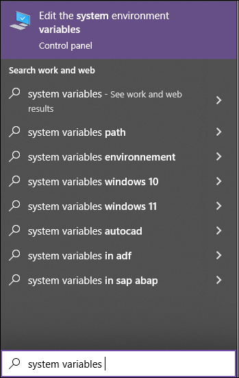
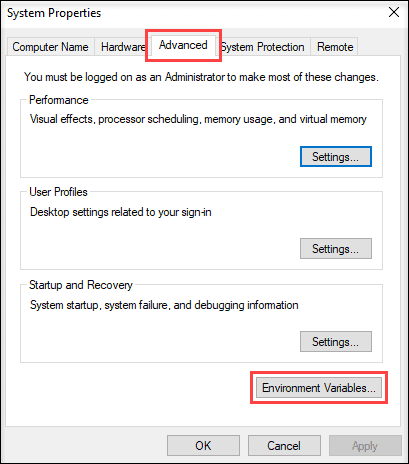
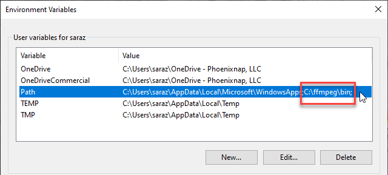

# Media Downloader

A powerful, user-friendly application for downloading media content from popular social platforms.

## Table of Contents

- [Overview](#overview)
- [Key Features](#key-features)
- [Supported Platforms](#supported-platforms)
- [Installation](#installation)
  - [Windows Installation](#windows-installation)
  - [Linux Installation](#linux-installation)
- [Usage Guide](#usage-guide)
- [Advanced Features](#advanced-features)
- [Troubleshooting](#troubleshooting)
- [Contributing](#contributing)
- [License](#license)
- [Disclaimer](#disclaimer)

## Overview

The Media Downloader is a sophisticated, cross-platform application designed to streamline the process of downloading media content from various Media Downloader platforms. Built with Python and featuring a modern, intuitive GUI, this toolkit empowers users to easily archive and manage their favorite online content.

## Key Features

- **Multi-Platform Support**: Seamlessly download content from major Media Downloader sites.
- **Customizable Downloads**: Choose video quality, audio-only options, and more.
- **Bulk Processing**: Queue multiple downloads for efficient batch processing.
- **User Authentication**: Securely log in to platforms like Instagram for expanded access.
- **Flexible Save Options**: Customize where and how your media is saved.
- **Progress Tracking**: Real-time updates on download status and progress.
- **Error Handling**: Robust error management with clear user feedback.

## Supported Platforms

- [](https://img.shields.io/badge/YouTube-FF0000?style=for-the-badge&logo=youtube&logoColor=white)
- [](https://img.shields.io/badge/Instagram-E4405F?style=for-the-badge&logo=instagram&logoColor=white)
- [](https://img.shields.io/badge/Twitter-1DA1F2?style=for-the-badge&logo=twitter&logoColor=white)
- [](https://img.shields.io/badge/Pinterest-%23E60023.svg?&style=for-the-badge&logo=Pinterest&logoColor=white)

## Installation

### Windows Installation

Follow these steps to install the  Media Downloader Toolkit on Windows:

1. **Download the installer**
   - Go to our [releases page]https://github.com/MSC72m/media_downloader/releases/download/v0.1.0/MediaDownloaderSetup.zip).
   - Download the latest `.zip` file.
   - Extract the .zip file in the same directory(folder)

   

2. **Run the installer**
   - Locate the downloaded `.exe` file in your Downloads folder.
   - Double-click the file to start the installation process(run as admin)

   

3. **Navigate the installation wizard**
   - Click "Next" to proceed through the welcome screen.

   

4. **Choose installation location**
   - Select where you want to install the program or use the default location.
   - Click "Next" to continue.

   

5. **Select additional tasks**
   - Choose whether to create a desktop shortcut.
   - Click "Next" to proceed.

   

6. **Complete the installation**
   - Review your choices and click "Install" to begin the installation.
   - Wait for the installation to complete.

   

7. **Finish the setup**
   - Click "Finish" to exit the installer.
   - The Media Downloader is now installed on your system.

8. **Launch the application**
   - Use the desktop shortcut or find the application in your Start menu.

### Linux Installation

Follow these steps to install the Media Downloader Toolkit on Linux:

1. **Verify Python installation**
   Open a terminal and run:
   ```bash
   python3 --version
   ```
Ensure you have Python 3.6 or higher installed.

2. **Install Git (if not already installed)**
   For Ubuntu/Debian:
   ```bash
      sudo apt-get update
      sudo apt-get install git
      ```
   For Fedora:
   ```bash 
     sudo dnf install git
   ```
3. **Clone the repository**
   ```bash
      git clone https://github.com/MSC72m/media_downloader.git
      cd media_downloader
   ```

4. **Set up a virtual environment (recommended)**
   ```bash
      python3 -m venv venv
      source venv/bin/activate
   ```
5. **Install dependencies**
   ```bash
   pip install -r requirements.txt
   ```
6. **Launch the application**
   ```bash
   cd /src
   python main.py
   ```
7. **Create a desktop shortcut (optional)**
    Create a .desktop file in ~/.local/share/applications/:
   ```bash
   vim ~/.local/share/applications/media_downloader.desktop
   ```
   Add the following content (adjust paths as needed):
   (change ``` /path/to/venv``` and ```/path/to/media_downloader/src/main.py``` ```/path/to/media_downloader/icon.png```  to your actual paths to make this work)
   ```bash
   [Desktop Entry]
   Name= media_downloader
   Exec=/path/to/venv/bin/python /path/to/downloader/main.py
   Icon=/path/to/media_downloader/icon.png
   Type=Application
   Categories=Utility;
   ```

## Usage Guide

### Adding Content:

- Paste the media URL into the input field.
- Click "Add" and provide a custom name if desired.

### Configuring Options:

- YouTube: Select quality, enable playlist download, or choose audio-only.
- Instagram: Use the "Instagram Login" for authenticated access.

### Managing Queue:

- Remove items with "Remove Selected" (you need to select all the string of each link manually with our mouse) or clear all with "Clear All".
- Initiate downloads with "Download All".

### Customizing Save Location:

- Access the file browser via "Manage Files".
- Navigate and set your preferred download directory.

### Monitoring Downloads:

- Track overall progress via the status label and progress bar.
- Check individual download statuses in the download list.

## Advanced Features

### YouTube Enhancements

- Quality selection (360p to 1080p)
- Playlist support
- Audio extraction capability

### Instagram Capabilities

- Support for posts, reels, and carousels
- Caption preservation

### Twitter Integration

- Download images and videos from tweets

### Pinterest Functionality

- High-quality image retrieval from pins and boards
- Automated file naming based on pin content

## Troubleshooting

| Issue                   | Solution                                             |
|-------------------------|------------------------------------------------------|
| Network Errors          | Check internet connection and retry                  |
| Unsupported URL         | Verify the URL is from a supported platform          |
| Authentication Failures | Ensure correct login credentials for Instagram       |
| Download Errors         | Consult application logs for detailed error messages |

## Contributing

We welcome contributions! To contribute:

1. Fork the repository.
2. Create a feature branch: `git checkout -b feature/NewFeature`
3. Commit changes: `git commit -m 'Add NewFeature'`
4. Push to the branch: `git push origin feature/NewFeature`
5. Submit a pull request.

## License

This project is licensed under the MIT License. See LICENSE for details.

## Disclaimer

The Media Downloader Toolkit is intended for personal use only. Users are responsible for adhering to the terms of service of the respective platforms and all applicable copyright laws. The developers assume no liability for misuse of this software.